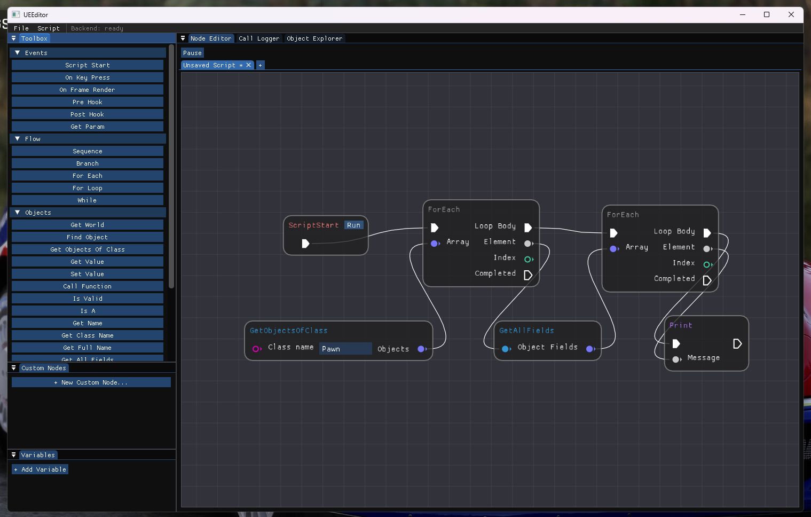
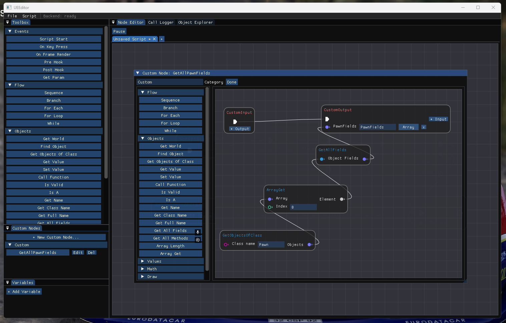
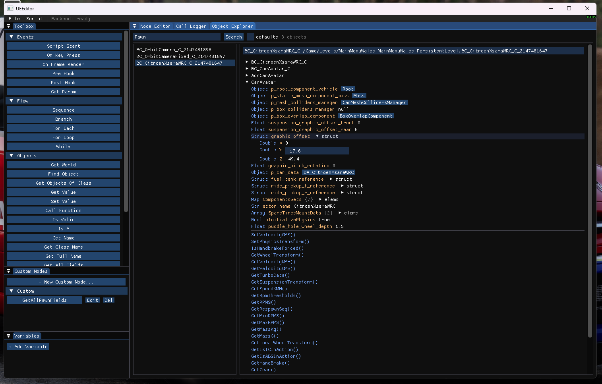
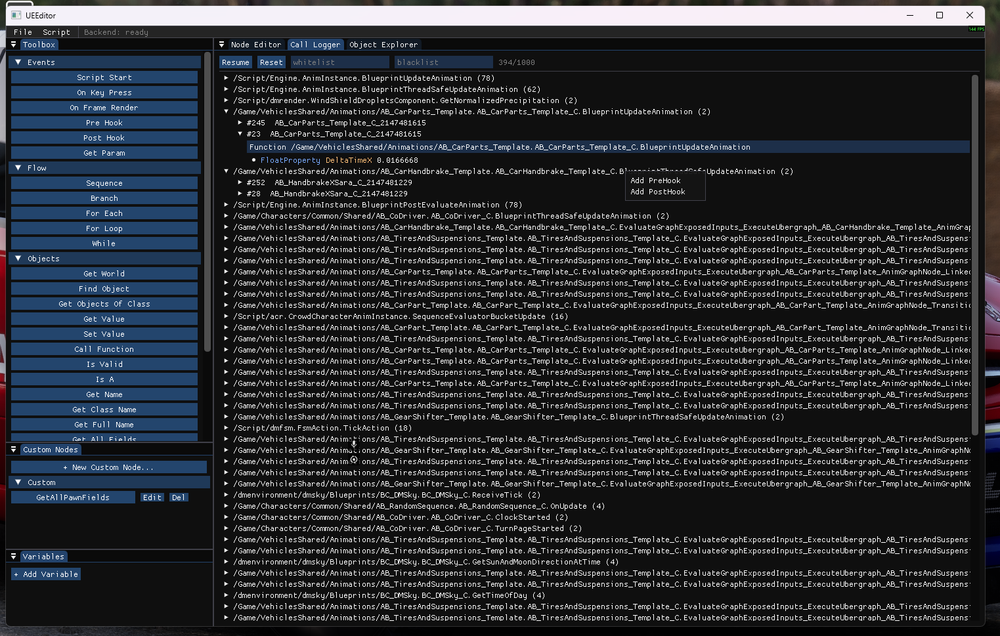

# UEMod

[](https://ko-fi.com/chris_tvyt)

UEMod is a universal Unreal Engine 4/5 scripting engine built on top of the Blueprint system. Write, hook, and inspect logic in any UE4/5 game using a graph-based node editor on top of a reflection and hooking backend, without needing a matching source build.



## Features

- **Graph-based scripting**: build logic visually with nodes
- **Event nodes**: `ScriptStart`, `OnKeyPress`, `OnFrameRender`, `HookFunction` (pre-hook or post-hook)
- **Custom node builder**: package a subgraph as a reusable node and share it with others
- **Concurrent execution**: run multiple node graphs at the same time
- **Variables**: read/write variable nodes scoped to a graph
- **Function call logger**: filter by function, inspect parameters and return values in real time
- **Object explorer**: browse and edit any live UObject and its fields
- **Save/load**: persist graphs and project state to disk







## Architecture

The project has two components:

- **[UEHook](UEHook/)**: the backend. A static library that provides UE4/5 reflection and hooking: object/class lookup, dynamic property get/set, `ProcessEvent` hooking with pre/post callbacks, and game-thread dispatch. Offsets (GObjects, GNames, FProperty vs UProperty, etc.) are auto-detected at `UE::Initialize()`, with overrides available via `UEHookConfig` for games that need them.
- **[UEEditor](UEEditor/)**: the frontend. The ImGui-based node editor (built on [imgui-node-editor](UEEditor/third_party/NodeEditor)), object explorer, and function call logger. Builds either as a standalone `.exe` (UI only) or as a DLL that links `UEHook` and drives a target game.

```
UEMod/
├── UEHook/                # reflection + hooking backend (static lib)
│   ├── include/UEHook.h   # public API
│   ├── src/                 Core / Engine / Reflection / Unreal
│   └── examples/           example_mod.cpp, sample injectable DLL
└── UEEditor/               # node editor frontend (ImGui + node-editor)
    ├── src/                app, graph, nodes, object explorer, call logger
    └── third_party/        ImGui, imgui-node-editor
```

## Building

Windows only. Visual Studio 2022 (or any MSVC toolchain with C++17) and CMake 3.16+.

### UEHook (backend / SDK)

```bash
cd UEHook
build.bat            # Release
build.bat Debug      # Debug
```

Produces `build/lib/<Config>/UEHook.lib` and, since `BUILD_EXAMPLES` defaults on, `build/bin/<Config>/example_mod.dll`, a sample mod DLL.

### UEEditor (frontend)

```bash
cd UEEditor
build.bat
```

This builds both flavors:

- `build/`: standalone `.exe`, UI only, no backend, nothing executes against a game
- `build-dll/`: `UEEDITOR_DLL=ON`, built as a shared library that links `UEHook` and can be injected into a running UE4/5 process to drive graphs

## Usage

Link `UEHook` into your own injected DLL and drive it from code:

```cpp
#include "UEHook.h"

UEHookConfig cfg;
cfg.verbose = true;
if (UE::Initialize(cfg)) {
    UEObject pawn = UE::GetObjectsOfClass("Pawn").front();
    float hp = pawn.GetValue("Health").AsFloat();
    pawn.SetValue("bCanBeDamaged", UEValue::MakeBool(false));

    Hooking::AddPostByName("ReceiveDamage", [](Hooking::HookContext& ctx) {
        float dmg = ctx.Params.Get<float>("DamageAmount");
    });
}
```

See [`UEHook/examples/example_mod.cpp`](UEHook/examples/example_mod.cpp) for a full sample covering dynamic property read/write, class/property introspection, container probing, and game-thread dispatch. You can also skip writing code and build the graph directly in UEEditor.

## License

MIT, with an attribution requirement. See [LICENSE](LICENSE). Distribution or public use of UEMod or derivative works must credit the original author, Snayck.

## Support

If UEMod is useful to you, consider supporting development on [Ko-fi](https://ko-fi.com/chris_tvyt).

## disclaimer

this, and all related .MD files are generated in part with AI assistance.
